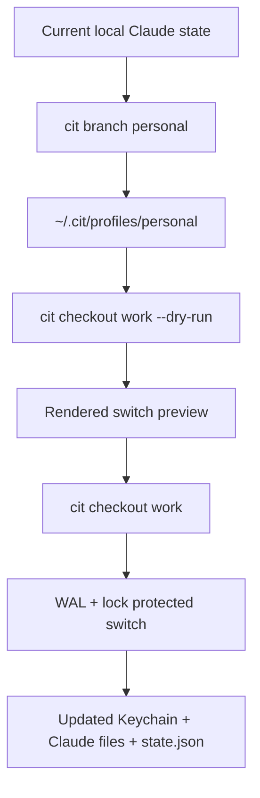
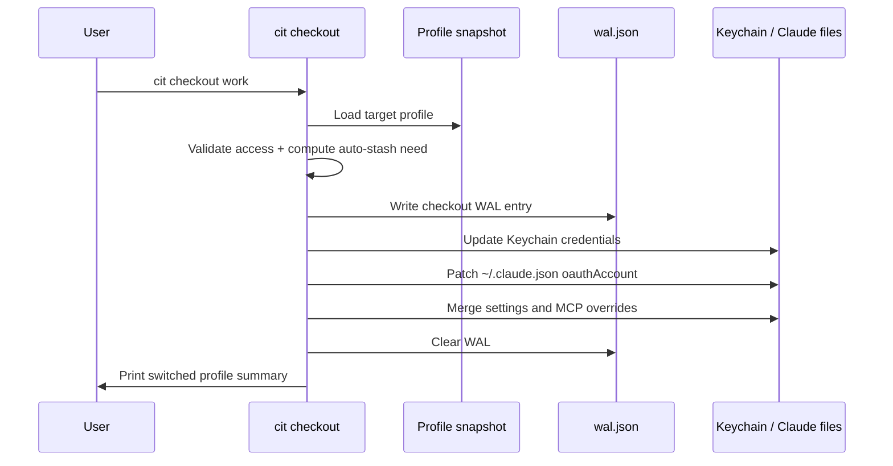

# cit

> Git-style account switching for Claude Code.

`cit` is a local-first CLI for saving, inspecting, and switching Claude Code accounts on macOS. It treats account state like a lightweight git workflow: you can create named profiles, switch between them, stash the current state, preview changes before applying them, and inspect local usage history.

## Why `cit` exists

Claude Code stores one active identity across multiple places:

- the macOS Keychain entry for Claude credentials
- `~/.claude.json` for account metadata
- `~/.claude/settings.json` and `~/.claude/.mcp.json` for behavior and MCP defaults

Switching between a personal plan and a work account usually means manual exports, file edits, and a high chance of ending up in a half-switched state. `cit` turns that into a repeatable local workflow with safety rails.

## Highlights

- **Git-style mental model** — `branch`, `checkout`, `stash`, `log`
- **Atomic switching** — file lock + write-ahead log recovery around checkout
- **Safe previews** — `cit checkout <name> --dry-run` shows what would change before mutating anything
- **Profile-aware configuration** — merge per-profile model, permission mode, and MCP settings on checkout
- **Local session visibility** — inspect Claude session usage and estimated token cost from local JSONL files
- **Coverage-enforced development** — the repository fails tests below 80% total coverage for `cit`

## Quick start

### Install for local development

```bash
python3 -m venv .venv
./.venv/bin/python -m pip install -e ".[dev]"
```

### Try the core workflow

```bash
# Inspect the current Claude account state
./.venv/bin/cit status

# Save the current state as a named profile
./.venv/bin/cit branch personal --with-config

# Preview a switch before applying it
./.venv/bin/cit checkout work --dry-run

# Apply the switch
./.venv/bin/cit checkout work
```

### Example dry-run output

```text
Dry run: checkout 'work'
Profile: personal -> work
Account: active@example.com -> work@example.com
~ model: opus -> opus[1m]
+ mcp.memory
! auto-stash: yes
No files were changed.
```

## Command map

| Command | Purpose |
| --- | --- |
| `cit branch` | Save, list, and remove named Claude account profiles |
| `cit checkout` | Switch to a saved profile, switch back, or preview a switch |
| `cit status` | Print the active account, subscription, model, and stash state |
| `cit config` | Manage global and per-profile defaults |
| `cit stash` | Save and restore temporary account snapshots |
| `cit log` | Inspect local Claude session usage and estimated cost |

## How it works

### State flow



### Checkout safety pipeline



## Repository layout

```text
cit/
  commands/       Top-level CLI commands
  core/           State, config, profile, WAL, session logic
  models/         Pydantic models for config, profiles, and sessions
  platform/       OS-specific credential storage backends
tests/            Coverage-enforced regression and unit tests
docs/             Detailed design notes and implementation references
```

## Safety model

`cit` is intentionally conservative.

- `checkout` uses a file lock to avoid concurrent mutations
- write operations are protected by `wal.json` so interrupted switches can be recovered
- dry-run previews never mutate Keychain, state, or Claude files
- current state can be auto-stashed before a switch when changes are detected
- profile and stash snapshots are stored with private filesystem permissions

## Configuration

`cit` resolves configuration in this order:

1. built-in defaults
2. `[global]` values in `~/.cit/config.toml`
3. `[profile.<name>]` values in `~/.cit/config.toml`

Supported keys today:

- `model`
- `permission-mode`
- `auto-stash`
- `mcp.<server>`

Example:

```toml
[global]
auto-stash = true

[profile.work]
model = "opus[1m]"
permission-mode = "dangerousSkipPermissions"

[profile.personal.mcp.memory]
command = "npx"
args = ["@anthropic/memory-mcp"]
```

## Platform scope

`cit` currently targets **macOS**.

- It depends on the macOS `security` CLI and the Claude Keychain entry layout.
- Windows, Linux, and WSL are not part of the current v1 scope.
- The codebase already separates platform concerns behind a credential store abstraction, so broader support is possible later.

## Development

### Run the test suite

```bash
./.venv/bin/pytest
```

### Coverage policy

- The repository must maintain at least **80% total test coverage** for the `cit` package.
- The default pytest configuration enforces coverage and prints missing lines.

## Project status

Implemented today:

- profile save/list/delete flows
- checkout with WAL-backed atomic switching
- checkout dry-run preview
- stash stack management
- profile-scoped config resolution and MCP merging
- local session usage logging with estimated cost
- branded CLI help and examples

## Documentation

- [Design specification](docs/DESIGN.md)
- [Changelog](CHANGELOG.md)

## Contributing

Contributions should keep the project local-first, predictable, and safe.

- keep repository-authored content in English
- preserve or improve the safety model around switching
- add tests for behavior changes
- keep the total `cit` package coverage at or above 80%

## License

This repository does not currently ship a separate `LICENSE` file. Add one before publishing broadly as an open-source package.
